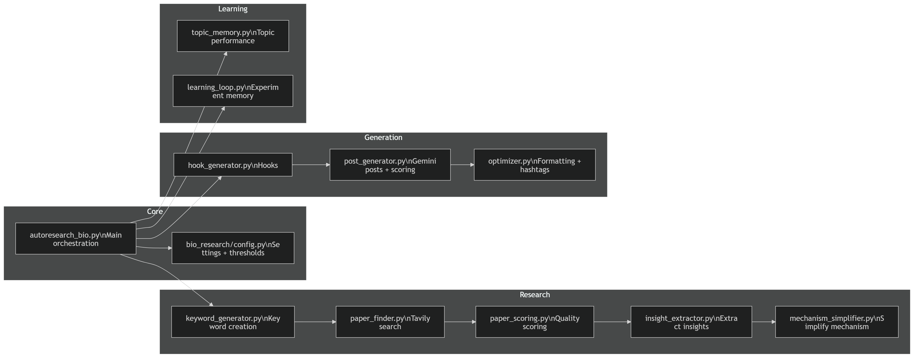
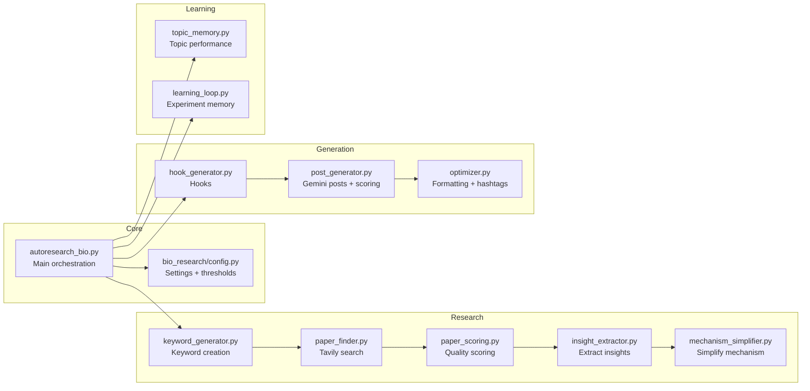
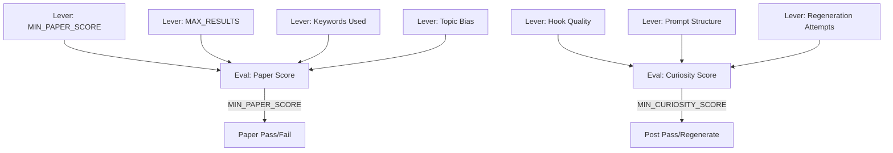
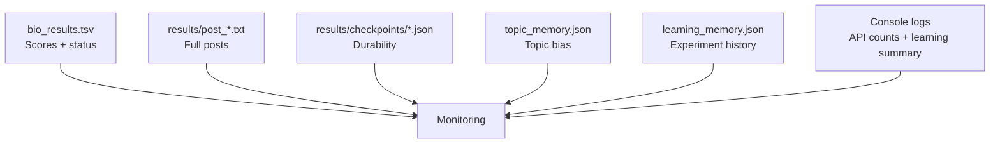

# Architecture (AutoResearch Bio Pipeline)

This is a simple, visual overview of how the pipeline works, what levers you can tune, what gets evaluated, and where results and monitoring live.

## 1. End-to-End Flow

```mermaid
flowchart TD
  A[Run: autoresearch_bio.py] --> B[Env Loader]
  B --> C[KeywordGenerator]
  C --> D[PaperFinder (Tavily)]
  D --> E[PaperScorer]
  E -->|score >= MIN_PAPER_SCORE| F[InsightExtractor]
  E -->|score < MIN_PAPER_SCORE| X[Skip Paper]
  F --> G[MechanismSimplifier]
  G --> H[HookGenerator]
  H --> I[PostGenerator (Gemini)]
  I --> J[Curiosity Scoring]
  J --> K[Optimizer]
  K --> L[Results Output]
  L --> M[LearningLoop + TopicMemory]
```

## 2. Major Components and Code Files





## 3. Evals, Optimizations, and Levers

.png>)



## 4. Outputs and Monitoring

.png>)



## 5. Where to Look for Each Concern

Levers:

- `MIN_PAPER_SCORE`, `MIN_CURIOSITY_SCORE`: `bio_research/config.py`
- Search breadth: `bio_research/paper_finder.py`
- Keyword generation and bias: `bio_research/keyword_generator.py` and `topic_memory.py`
- Curiosity scoring: `bio_research/post_generator.py`

Monitoring:

- Run logs: console output
- Aggregated results: `bio_results.tsv`
- Full posts: `results/post_*.txt`
- Learning history: `learning_memory.json`
- Topic performance: `topic_memory.json`

Iteration workflow:

- See `CONDUCT_RESEARCH.md` for step-by-step iteration and evaluation guidance.
